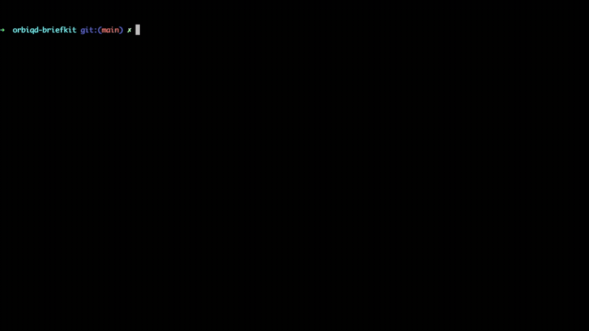

# OrbiqD BriefKit

[](LICENSE)
[](go.mod)


## Overview

BriefKit runs your local, subscription-based agent CLIs (no APIs or API keys) directly in your working directory or an
isolated copy of any local project. It ships as a single, self-contained CLI and an MCP server, with no Python/JS and
no extra runtimes. Agents see your repository the same way you do, with no uploads and no remote context copying.
BriefKit supports workflows where more than one LLM collaborates in the same workspace.

Currently supported local agent CLIs are `claude`, `codex`, `gemini`.

## Usage

<details>
<summary>As a CLI</summary>

**Agent-to-agent context handoff**

Let Codex analyze a module, then ask Gemini to confirm or expand the findings from the same repo.

```bash
briefkit-ctl ask codex "Map the auth flow and list risk points"
briefkit-ctl ask gemini "Validate Codex findings and propose improvements"
```

**Agent challenge**

Run the same prompt across agents and compare viewpoints.

```bash
briefkit-ctl ask claude "Review this PR for design issues"
briefkit-ctl ask codex "Review this PR for design issues"
briefkit-ctl ask gemini "Review this PR for design issues"
```

**Cross-agent review**

Have one agent review work produced by another.

```bash
briefkit-ctl ask codex "Refactor the parser to reduce allocations"
briefkit-ctl ask claude "Review the parser refactor for correctness and style"
```

</details>

<details>
<summary>As an MCP Server</summary>



Note: You don't start `briefkit-mcp` manually. `briefkit-ctl setup` registers BriefKit as an MCP server using the
`stdio` transport, so your runtime (e.g. Claude Code) spawns it on demand.

</details>

## Installation

### Prerequisites

At least one agent CLI installed and available on your `PATH` (`claude`, `codex`, `gemini`).

### Install binaries

<details>
<summary>Linux (.deb)</summary>

Requires `curl`, `jq`, and `dpkg`.

```bash
arch=$(uname -m); case "$arch" in x86_64|amd64) arch=amd64 ;; aarch64|arm64) arch=arm64 ;; *) echo "Unsupported arch: $arch" >&2; exit 1 ;; esac; \
url=$(curl -sL https://api.github.com/repos/orbiqd/orbiqd-briefkit/releases/latest | jq -r ".assets[] | select(.name | endswith(\"linux_${arch}.deb\")) | .browser_download_url" | head -n1); \
curl -L -o /tmp/briefkit.deb "$url" && sudo dpkg -i /tmp/briefkit.deb
```

</details>

<details>
<summary>Linux (.rpm)</summary>

Requires `curl`, `jq`, and `rpm`.

```bash
arch=$(uname -m); case "$arch" in x86_64|amd64) arch=amd64 ;; aarch64|arm64) arch=arm64 ;; *) echo "Unsupported arch: $arch" >&2; exit 1 ;; esac; \
url=$(curl -sL https://api.github.com/repos/orbiqd/orbiqd-briefkit/releases/latest | jq -r ".assets[] | select(.name | endswith(\"linux_${arch}.rpm\")) | .browser_download_url" | head -n1); \
curl -L -o /tmp/briefkit.rpm "$url" && sudo rpm -i /tmp/briefkit.rpm
```

</details>

<details>
<summary>Linux (tarball to /usr/bin)</summary>

Requires `curl`, `jq`, and `tar`.

```bash
arch=$(uname -m); case "$arch" in x86_64|amd64) arch=amd64 ;; aarch64|arm64) arch=arm64 ;; *) echo "Unsupported arch: $arch" >&2; exit 1 ;; esac; \
url=$(curl -sL https://api.github.com/repos/orbiqd/orbiqd-briefkit/releases/latest | jq -r ".assets[] | select(.name | endswith(\"linux_${arch}.tar.gz\")) | .browser_download_url" | head -n1); \
tmpdir=$(mktemp -d) && curl -L -o "$tmpdir/briefkit.tar.gz" "$url" && tar -xzf "$tmpdir/briefkit.tar.gz" -C "$tmpdir" && \
sudo install -m 0755 "$tmpdir/briefkit-ctl" /usr/bin/briefkit-ctl && \
sudo install -m 0755 "$tmpdir/briefkit-mcp" /usr/bin/briefkit-mcp && \
sudo install -m 0755 "$tmpdir/briefkit-runner" /usr/bin/briefkit-runner
```

</details>

<details>
<summary>Homebrew (macOS)</summary>

```bash
brew tap orbiqd/briefkit
brew install briefkit
```

</details>

### Agent discovery and MCP setup

Run setup to discover local agent CLIs, create configs, and register the MCP server with supported runtimes. This lets you ask Claude Code to run Codex, for example.

```bash
briefkit-ctl setup
```

Ask your first prompt.

```bash
briefkit-ctl ask codex "Explain the architecture of this repo."
```

Setup options you may need:

- `--runtime-kind claude|codex|gemini` to limit configuration to specific runtimes
- `--setup-agent-mcp=false` to skip MCP server registration
- `--force` to overwrite existing agent configs
- `--enable-sandbox=true|false` to override runtime sandbox defaults

## Configuration and Paths

Default paths:

- Agent configs: `~/.orbiqd/briefkit/agents`
- State store: `~/.orbiqd/briefkit/state`
- Workspace runs: `~/.orbiqd/briefkit/state/workspaces/runs`
- Runtime logs: `~/.orbiqd/briefkit/logs/runtime`

Override paths with environment variables:

- `BRIEFKIT_AGENT_CONFIG_PATH`
- `BRIEFKIT_STATE_PATH`
- `BRIEFKIT_RUNTIME_LOG_DIR`

Example agent config (`~/.orbiqd/briefkit/agents/codex.yaml`):

```yaml
runtime:
  kind: codex
  config:
    requireWorkspaceRepository: false
  feature:
    enableSandbox: false
timeout: 5m
```

The `timeout` field is optional. When omitted, it defaults to `5m`. The `--timeout` flag in `briefkit-ctl ask` overrides this value.

Runtime kinds:

- `claude`
- `codex`
- `gemini`

`briefkit-ctl setup` creates configs at `~/.orbiqd/briefkit/agents/<agent-id>.yaml`.

## MCP Server

Start the MCP server:

```bash
briefkit-mcp
```

By default, `briefkit-ctl setup` registers the MCP server with supported runtimes. Use `--setup-agent-mcp=false` to skip registration.

## Workspaces

A workspace provides an agent with an isolated, writable copy of a codebase. The original source is never modified. After the execution finishes, the temporary copy is removed automatically.

Without a workspace, the agent runs directly in the current working directory.

### Execution states

When a workspace is used, the execution goes through an additional state:

```
created → started → provisioning → running → succeeded / failed
```

The `provisioning` state covers the time spent preparing the workspace (copying files or cloning a repository). For large git repositories this can take a while — the state makes it visible.

### Providers

#### No workspace (default)

The agent runs in the current working directory. Files are read and written directly.

```bash
briefkit-ctl ask codex "Explain the auth module."
```

---

#### `dir://` — local directory copy

Copies a local directory into a fresh per-execution directory under `~/.orbiqd/briefkit/state/workspaces/runs/`. The agent sees an exact copy of the source; changes it makes stay in the copy and are discarded at cleanup.

```
dir:///absolute/path/to/project
```

```bash
briefkit-ctl ask claude --workspace "dir:///home/user/myproject" "Review the API surface."
```

Use this when you want to point an agent at a project that is not your current directory, or when you want to protect a local directory from agent writes.

---

#### `git+https://` — remote git repository over HTTPS

Clones a public or private git repository into a fresh per-execution directory. Auth relies on the user's existing git credential helpers, `.netrc`, and `~/.gitconfig`. No API keys or extra configuration needed.

```
git+https://github.com/org/repo.git
git+https://github.com/org/repo.git?ref=main
git+https://github.com/org/repo.git?ref=v2.1.0
git+https://github.com/org/repo.git?ref=abc1234
```

The optional `ref` query parameter selects a branch, tag, or commit. When omitted, the repository's default branch is used.

```bash
# Default branch
briefkit-ctl ask claude --workspace "git+https://github.com/golang/example.git" "Describe this repo."

# Specific branch
briefkit-ctl ask codex --workspace "git+https://github.com/org/repo.git?ref=feature/payments" "Review the payments module."

# Specific tag
briefkit-ctl ask gemini --workspace "git+https://github.com/org/repo.git?ref=v2.1.0" "What changed in this release?"
```

---

#### `git+ssh://` — remote git repository over SSH

Same as `git+https://` but uses SSH. Auth relies on the user's SSH agent (`SSH_AUTH_SOCK`) and key files. No extra configuration needed if SSH access to the host already works in your terminal.

```
git+ssh://git@github.com/org/repo.git
git+ssh://git@github.com/org/repo.git?ref=main
```

```bash
briefkit-ctl ask claude --workspace "git+ssh://git@github.com/org/private-repo.git" "Summarize the architecture."
```

---

### MCP Server

When using BriefKit as an MCP server, the `workspace` parameter is available on every `ask_*` tool. The same URI formats apply.

## CLI Manual

### briefkit-ctl

Usage:

```bash
briefkit-ctl [global flags] <command>
```

Global flags:

- `-v`, `--log-level` (`debug|info|warn|error`, default: `info`)
- `--log-format` (`text-color|text-no-color|json`, default: `text-color`)
- `--log-quiet` (disable logging)
- `-s`, `--store-state-path` (default: `~/.orbiqd/briefkit/state`)
- `--store-agent-config-path` (default: `~/.orbiqd/briefkit/agents`)
- `--version` (print version)

<details>
<summary>briefkit-ctl agent list</summary>

Lists configured agents (JSON output).

```bash
briefkit-ctl agent list
```

</details>

<details>
<summary>briefkit-ctl agent add</summary>

Adds a new agent entry. Note: currently not implemented.

```bash
briefkit-ctl agent add <id> <kind> <path>
```

Kind values: `claude`, `codex`, `gemini`.

</details>

<details>
<summary>briefkit-ctl ask</summary>

Runs a prompt with a configured agent.

```bash
briefkit-ctl ask [flags] <agent-id> <prompt>
```

Flags:

- `--timeout` (duration, e.g. `30s`, `5m`)
- `--model` (override model)
- `--conversation-id` (continue a conversation)
- `--workspace` (workspace URI; see [Workspaces](#workspaces) for supported schemes and examples)

</details>

<details>
<summary>briefkit-ctl setup</summary>

Auto-discovers local agent CLIs, creates configs, and optionally registers the MCP server with supported runtimes.

```bash
briefkit-ctl setup [flags]
```

Flags:

- `--runtime-kind` (repeatable; one of `claude`, `codex`, `gemini`)
- `--setup-agent-config` (default: `true`)
- `--setup-agent-mcp` (default: `true`)
- `--enable-sandbox` (set `true` or `false` to override defaults)
- `--force` (overwrite existing configs)

</details>

<details>
<summary>briefkit-ctl state execution list</summary>

Lists stored executions (JSON output).

```bash
briefkit-ctl state execution list
```

</details>

<details>
<summary>briefkit-ctl state execution show</summary>

Shows details for a single execution (JSON output).

```bash
briefkit-ctl state execution show <execution-id>
```

</details>

<details>
<summary>briefkit-ctl state execution create</summary>

Creates a new execution record (advanced use; JSON output with execution ID).

```bash
briefkit-ctl state execution create --agent-id <id> [flags] <prompt>
```

Flags:

- `-w`, `--workspace` (workspace URI, e.g. `dir:///path/to/project`)
- `-t`, `--timeout` (default: `5m`)

</details>

## Troubleshooting

<details>
<summary>Problem: `briefkit-ctl setup` does not find your agent CLI.</summary>

- Verify the agent binary is in your PATH (`which claude`, `which codex`, `which gemini`).

</details>

<details>
<summary>Problem: `briefkit-ctl ask` fails with missing agent config.</summary>

- Run `briefkit-ctl setup` and confirm the agent appears in `briefkit-ctl agent list`.

</details>

<details>
<summary>Problem: MCP tools do not appear in your client.</summary>

- Ensure the MCP client points to the absolute path of `briefkit-mcp`.
- Restart the MCP client after config changes.

</details>

## License

MIT License. See [LICENSE](LICENSE).
